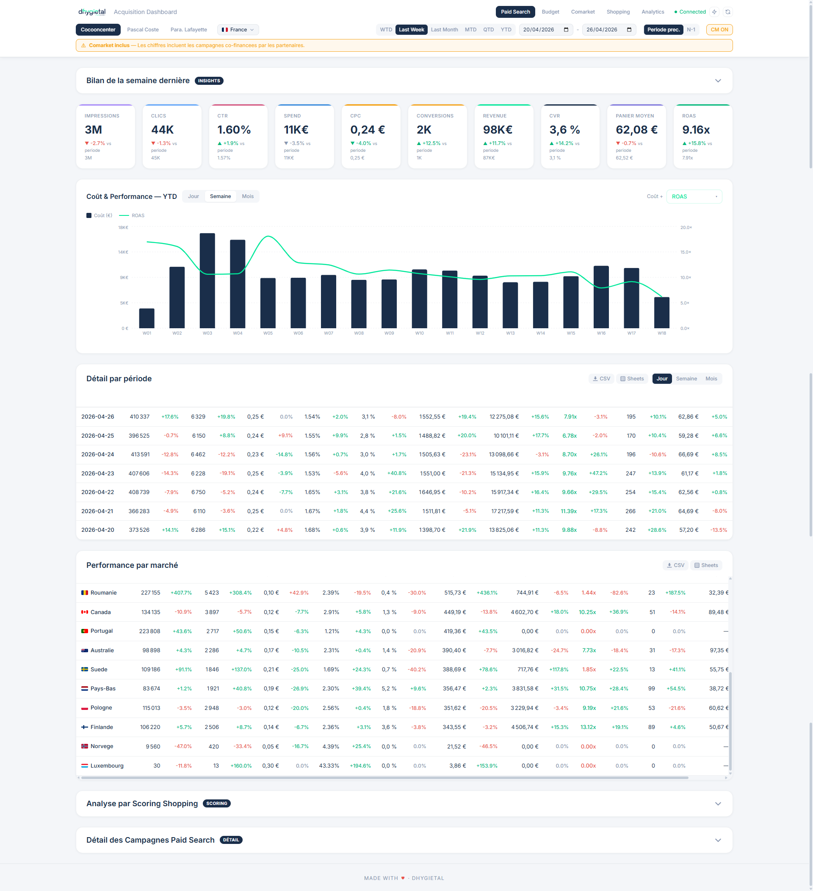
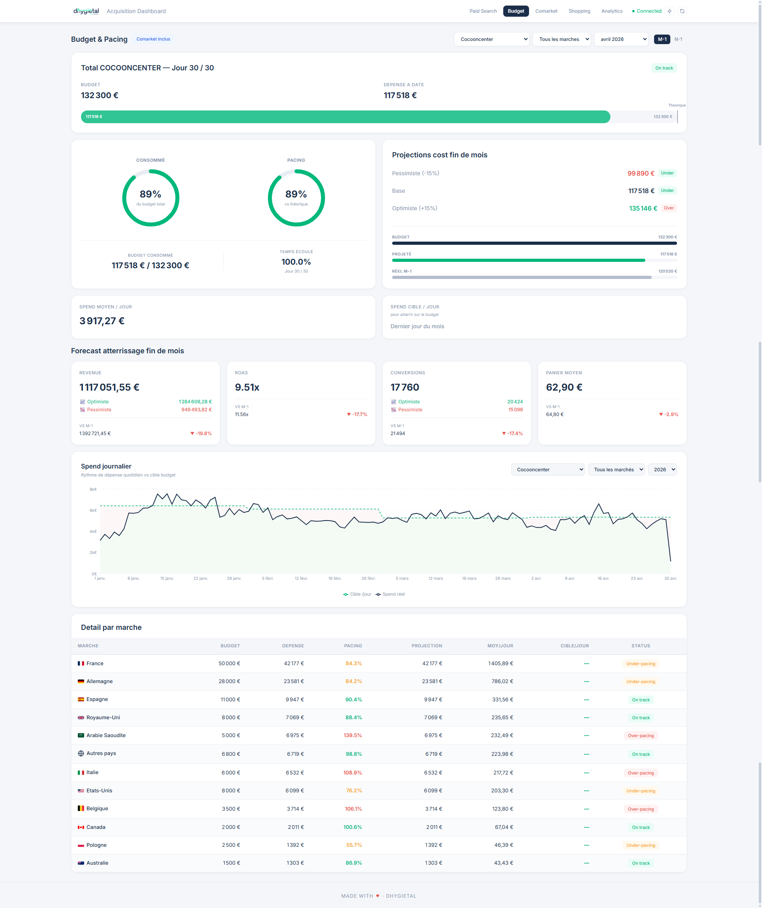
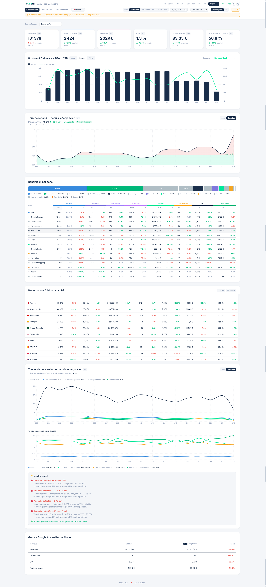

# MagicDash

Dashboard de pilotage **acquisition multi-marques / multi-marchés**. Centralise Google Ads, GA4, Merchant Center, Meta Ads et budgets Google Sheets dans une seule interface React.



---

## Sommaire

1. [Aperçu](#aperçu)
2. [Stack technique](#stack-technique)
3. [Prérequis](#prérequis)
4. [Installation pas-à-pas](#installation-pas-à-pas)
5. [Obtenir les credentials Google](#obtenir-les-credentials-google)
6. [Obtenir les credentials Meta (optionnel)](#obtenir-les-credentials-meta-optionnel)
7. [Configuration métier](#configuration-métier)
8. [Lancement](#lancement)
9. [Structure du projet](#structure-du-projet)
10. [API backend](#api-backend)
11. [Frontend — vues](#frontend--vues)
12. [Base de données SQLite](#base-de-données-sqlite)
13. [Cache, scheduler & rafraîchissement](#cache-scheduler--rafraîchissement)
14. [Dépannage](#dépannage)
15. [Conventions de code](#conventions-de-code)

---

## Aperçu

Le dashboard est protégé par un **login email/mot de passe** (utilisateurs gérés en local via un script CLI) puis expose 4 vues principales, configurables par marque et marché :

### Paid Search (4 sous-onglets)
- **Vue d'ensemble** — KPIs (spend, revenue, ROAS, conv., CVR, AOV…), tendance YTD, granularité jour/semaine/mois, performance par marché, détail campagnes, bilan hebdo automatique. Toggle **Source data business : Google Ads ↔ GA4**.
- **Budget** — pacing mensuel vs réel, projection fin de mois, spend journalier YTD.
- **Comarket** — performance des campagnes co-financées par les partenaires.
- **Shopping** — price competitiveness, top/flop produits & marques, qualité du flux Merchant Center, scoring PMax.



### Paid Social
KPIs Meta Ads (Facebook + Instagram) : spend, ROAS, CPM, CTR, CPA. Détail par campagne / ad set / creative, breakdown âge/genre/placement, audiences gagnantes/perdantes.

### Analytics (GA4)
Sessions, transactions, revenue, funnel d'achat, bounce rate, CVR/AOV, breakdown par canal, performance par marché.



### Feed Monitor
Snapshots quotidiens du flux Merchant Center pour détecter les changements d'attributs produits (prix, titre, image, disponibilité…). Tâche cron automatique à 8h15 Paris + déclenchement manuel.

---

## Stack technique

**Backend** — Node 20+, ESM, Express 4
- `google-ads-api` — Google Ads Reporting API
- `@google-analytics/data` — GA4 Data API
- `facebook-nodejs-business-sdk` — Meta Marketing API (Paid Social)
- `googleapis` — Sheets, Merchant Center, OAuth
- `better-sqlite3` — DB locale (audit campagnes, snapshots Feed Monitor)
- `bcryptjs` + `jsonwebtoken` — auth utilisateur (login dashboard)
- `node-cron` — scheduler (snapshot quotidien Feed Monitor)
- `nodemon` (dev) — auto-reload sur changement de fichier
- `pm2` (prod / Windows détaché) — gestion de process avec restart auto

**Frontend** — Vite + React 18
- `@tanstack/react-query` — fetch + cache
- `recharts` — graphiques
- `tailwindcss` — design tokens

**Workspaces npm** — `backend/` + `frontend/` orchestrés depuis la racine.

---

## Prérequis

- **Node.js ≥ 20** (recommandé 22 LTS) — [nodejs.org](https://nodejs.org)
- **npm ≥ 9** (livré avec Node)
- **Git** — [git-scm.com](https://git-scm.com)
- **PM2** (optionnel, pour lancement détaché) — `npm install -g pm2`
- Un **compte Google** ayant accès :
  - À un compte Google Ads (idéalement un MCC pour gérer plusieurs sous-comptes)
  - Aux properties GA4
  - À Merchant Center (pour Shopping + Feed Monitor)
  - À un Google Sheet de budgets (pour le module Budget)
- (Optionnel) Un **compte Meta Business** avec accès à Facebook Ads Manager (pour Paid Social)

---

## Installation pas-à-pas

### 1. Cloner

```bash
git clone <url-du-repo>.git
cd magicdash
```

### 2. Installer les dépendances

```bash
npm run install:all
```

Installe `backend/` + `frontend/` (npm workspaces).

### 3. Créer le fichier `.env`

```bash
cp backend/.env.example backend/.env
```

Édite `backend/.env` (cf. sections credentials ci-dessous).

### 4. Créer un compte utilisateur (login dashboard)

Le dashboard est protégé par un login email/mot de passe (séparé de l'OAuth Google). Au moins **un utilisateur** doit exister avant de pouvoir se connecter.

```bash
cd backend
node scripts/addUser.js <email> <password> [nom]
# Ex : node scripts/addUser.js admin@example.com "MonMdpFort" "Admin"
```

Cela crée / met à jour `backend/users.json` (gitignoré). Le mot de passe est hashé avec bcrypt avant stockage.

> Tu peux relancer la même commande pour ajouter d'autres comptes ou mettre à jour un mot de passe existant.

### 5. Lancer en mode dev

```bash
npm run dev:all
```

Ouvre [http://localhost:5173](http://localhost:5173) :
1. **Login** avec l'email/password créé à l'étape 4
2. **Connecter Google** dans le header pour le premier OAuth (récupération des tokens API)

---

## Obtenir les credentials Google

### 1. OAuth Client ID + Secret

1. [Google Cloud Console](https://console.cloud.google.com)
2. Créer un projet (ou en sélectionner un)
3. **APIs & Services → Library** → activer :
   - Google Ads API
   - Google Analytics Data API
   - Content API for Shopping (Merchant Center)
   - Google Sheets API
4. **OAuth consent screen**
   - User type : **External** (ou Internal si Google Workspace)
   - Renseigner nom de l'app + email support
   - Test users : ajouter ton email Google
5. **Credentials → Create Credentials → OAuth client ID**
   - Type : Web application
   - Authorized redirect URIs : `http://localhost:3001/auth/callback`
6. Copier dans `.env` :
   - `GOOGLE_CLIENT_ID`
   - `GOOGLE_CLIENT_SECRET`

### 2. Google Ads Developer Token

1. Sur ton MCC Google Ads → **Tools & Settings → API Center**
2. Demander un developer token (statut Test → Basic après review ~24h)
3. Copier dans `GOOGLE_DEVELOPER_TOKEN`

### 3. Login Customer ID (MCC)

ID de ton compte Manager (format `XXX-XXX-XXXX`, visible en haut à droite dans Google Ads).
→ `GOOGLE_ADS_LOGIN_CUSTOMER_ID`

### 4. Customer IDs par marque × marché

Pour chaque sous-compte Google Ads que tu veux remonter, renseigne dans `.env` :

```env
GOOGLE_ADS_ID_<MARQUE>_<MARCHE>=123-456-7890
```

Ex : `GOOGLE_ADS_ID_MAMARQUE_FR=123-456-7890`. Les marchés sans valeur sont automatiquement ignorés au runtime.

### 5. GA4 Property IDs

Pour chaque combinaison marque × marché :

```env
GA4_PROPERTY_<MARQUE>_<MARCHE>=123456789
```

Tu peux aussi définir un rollup brand-level : `GA4_PROPERTY_<MARQUE>=...`.

### 6. Merchant Center IDs (optionnel — pour Shopping/Feed Monitor)

```env
MC_ID_<MARQUE>_<MARCHE>=123456789
```

### 7. Budget Sheet ID (optionnel)

ID de ton Google Sheet de budgets (depuis l'URL : `/spreadsheets/d/<ID>/edit`)
→ `BUDGET_SHEET_ID`

### 8. JWT_SECRET (login dashboard)

Clé aléatoire ≥ 16 caractères pour signer les tokens de session. Génère-en une avec :

```bash
node -e "console.log(require('crypto').randomBytes(48).toString('hex'))"
```

Copie le résultat dans `JWT_SECRET=` de ton `.env`. **Ne partage jamais cette clé** : avec elle, on peut forger des tokens de connexion valides.

### Scopes OAuth demandés au runtime

Configurés dans `backend/auth.js` :
- `https://www.googleapis.com/auth/adwords`
- `https://www.googleapis.com/auth/analytics.readonly`
- `https://www.googleapis.com/auth/content`
- `https://www.googleapis.com/auth/spreadsheets.readonly`

Le compte Google qui fait le login doit avoir accès à toutes ces ressources.

---

## Obtenir les credentials Meta (optionnel)

Nécessaire **uniquement** pour la vue Paid Social. Sans ces variables, l'onglet est masqué/inactif.

### 1. App Meta + token long-lived

1. Va sur [developers.facebook.com](https://developers.facebook.com) → **My Apps**
2. Crée une app type **Business**
3. Dans l'app, ajoute le produit **Marketing API**
4. Récupère :
   - `META_APP_ID` (visible dans Settings → Basic)
   - `META_APP_SECRET` (idem, en clair après "Show")
5. Dans **Tools → Graph API Explorer** :
   - Sélectionne ton app
   - Demande les permissions `ads_read` + `business_management`
   - Génère un user access token, puis échange-le contre un **token long-lived** (60 jours) :
     ```
     https://graph.facebook.com/v21.0/oauth/access_token?grant_type=fb_exchange_token&client_id=<APP_ID>&client_secret=<APP_SECRET>&fb_exchange_token=<SHORT_TOKEN>
     ```
   - Idéalement, échange-le ensuite contre un **System User token** (permanent) via Business Manager → Users → System Users.
6. Copie le token dans `META_ACCESS_TOKEN`.

### 2. Ad Account IDs par marché

Format `act_XXXXXXXXXXXX` (visible dans Ads Manager → Settings → Ad Account ID, préfixe `act_` à ajouter).

```env
META_AD_ACCOUNT_ID_FR=act_xxxxxxxxxxxx
META_AD_ACCOUNT_ID_UK=act_xxxxxxxxxxxx
# etc.
```

Les marchés sans valeur sont masqués dans le frontend.

---

## Configuration métier

L'essentiel des marques / marchés / IDs est désormais **piloté par variables d'environnement** (cf. `backend/.env.example`). Les fichiers JS dans `backend/config/` ne contiennent plus que la **logique de mapping** et les enums.

| Fichier | Rôle |
|---|---|
| `accounts.js` | Lecture des `GOOGLE_ADS_ID_*` depuis l'env. **Source de vérité** des marques/marchés disponibles. |
| `ga4Properties.js` | Lecture des `GA4_PROPERTY_*` depuis l'env. |
| `ga4Streams.js` | Stream IDs GA4 par marché (filtrage par data stream). |
| `ga4FunnelEvents.js` | Noms d'événements GA4 du tunnel (view_item, add_to_cart, purchase…). |
| `paidSocialAccounts.js` | Lecture des `META_AD_ACCOUNT_ID_*`. |
| `budgetMarketMap.js` | Regroupement de petits marchés (`AUTRES_PAYS_MARKETS`). |
| `monitoredAttributes.js` | Attributs Merchant Center surveillés par Feed Monitor (titre, prix, image…). |
| `poasThresholds.js` | Seuil POAS de break-even par marché (utilisé par le scoring Shopping). |
| `loadEnv.js` | Helper qui résout les fallbacks (ex: NO/SA/CA → UK pour GA4). |

Pour ajouter un nouveau marché : ajoute simplement les variables `GOOGLE_ADS_ID_<MARQUE>_<NEW_MARKET>` + `GA4_PROPERTY_<MARQUE>_<NEW_MARKET>` dans `.env`, et mets à jour `MARKETS_BY_BRAND` dans `frontend/src/components/Header.jsx`.

---

## Lancement

### Mode dev (terminal ouvert, hot-reload)

```bash
npm run dev:all       # back + front en parallèle
# ou séparément :
npm run dev:back      # backend sur :3001 via nodemon
npm run dev:front     # frontend sur :5173 via Vite
```

### Mode détaché via PM2 (recommandé)

PM2 gère le restart auto et permet de tourner sans terminal visible. Le fichier [`ecosystem.config.cjs`](ecosystem.config.cjs) à la racine définit deux processes (`magicdash-backend` + `magicdash-frontend`).

```bash
npm run pm:start      # lance + sauvegarde l'état PM2
npm run pm:status     # liste les processes
npm run pm:logs       # tail des logs backend
npm run pm:restart    # redémarre les deux apps
npm run pm:stop       # arrête (les processes restent connus de PM2)
npm run pm:delete     # retire complètement de PM2
```

Le bouton **⚡ Reboot** de l'UI déclenche `process.exit(42)`, ce que PM2 traite comme un crash → restart auto. Les logs sont écrits dans `backend/logs/out.log` et `backend/logs/err.log`.

### Lanceur silencieux Windows (.vbs)

Pour lancer PM2 + ouvrir le navigateur sans fenêtre cmd :

```vbs
' start_dashboard.vbs
Set WshShell = CreateObject("WScript.Shell")
projectDir = "C:\chemin\vers\magicdash"
WshShell.Run "cmd /c cd /d """ & projectDir & """ && pm2 startOrReload ecosystem.config.cjs --update-env && pm2 save", 0, True
WScript.Sleep 3000
WshShell.Run "http://localhost:5173", 1, False
```

Double-clic → backend + frontend démarrent en arrière-plan, le dashboard s'ouvre.

### Mode production (serveur dédié)

```bash
cd frontend && npm run build       # génère frontend/dist/
# puis derrière nginx ou similaire pour servir dist + reverse proxy /api → :3001
cd backend && pm2 start ecosystem.config.cjs --env production
```

---

## Structure du projet

```
magicdash/
├── ecosystem.config.cjs          # Config PM2 (back + front)
├── package.json                  # Workspaces + scripts dev:* / pm:*
├── README.md
├── docs/
│   └── screenshots/              # Captures pour le README
│
├── backend/
│   ├── server.js                 # Express app + routes inline (kpis, markets, campaigns, granularity, budget, comarket, trend/ytd)
│   ├── auth.js                   # OAuth Google + isAuthenticated()
│   ├── userAuth.js               # Login utilisateur (bcrypt + JWT) + middleware requireUser
│   ├── googleAdsClient.js        # Client Google Ads + cache + scoring shopping
│   ├── ga4Client.js              # Client GA4 + cache
│   ├── metaAdsClient.js          # Client Meta Marketing API + cache
│   ├── aggregation.js            # Helpers d'agrégation
│   ├── dateUtils.js              # Périodes, comparaisons, formatage
│   ├── nodemon.json              # Config nodemon (dev)
│   ├── routes/
│   │   ├── ga4.js                # /api/ga4/*
│   │   ├── shopping.js           # /api/shopping/*
│   │   ├── paidSocial.js         # /api/paid-social/*
│   │   ├── feedMonitor.js        # /api/feed-monitor/*
│   │   ├── recommendations.js    # /api/recommendations
│   │   └── reports.js            # /api/reports/weekly-summary
│   ├── services/
│   │   ├── merchantCenterClient.js
│   │   ├── budgetSheetReader.js
│   │   ├── queryBuilder.js
│   │   ├── recommendationEngine.js
│   │   ├── paidSocialAggregator.js
│   │   ├── feedSnapshotService.js   # Snapshots quotidiens du flux MC
│   │   ├── scheduler.js             # Cron node-cron (8h15 Paris)
│   │   └── cacheWarmer.js           # Pré-chauffe les caches au démarrage
│   ├── scripts/
│   │   └── addUser.js            # CLI pour créer / mettre à jour un user
│   ├── config/                   # Mappings env → marques/marchés (cf. section dédiée)
│   ├── database/
│   │   ├── schema.sql
│   │   └── db.js                 # better-sqlite3 wrapper
│   ├── data/                     # SQLite files (gitignoré)
│   ├── logs/                     # Logs PM2 (gitignoré)
│   ├── tokens.json               # OAuth tokens (gitignoré)
│   ├── users.json                # Comptes utilisateurs hashés bcrypt (gitignoré)
│   └── .env                      # Credentials (gitignoré)
│
├── frontend/
│   ├── index.html
│   ├── tailwind.config.js        # Design tokens
│   ├── eslint.config.js
│   ├── .prettierrc.json
│   ├── src/
│   │   ├── App.jsx               # Routeur de vues (4 onglets + sub-tabs)
│   │   ├── main.jsx              # Bootstrap React + AuthProvider
│   │   ├── index.css
│   │   ├── components/
│   │   │   ├── LoginScreen.jsx   # Écran de login (email/mdp)
│   │   │   └── ...               # Vues + composants partagés
│   │   ├── contexts/
│   │   │   ├── AuthContext.jsx   # State auth + login/logout
│   │   │   └── ComarketContext.jsx
│   │   ├── hooks/useAdsData.js   # React Query hooks
│   │   └── utils/
│   │       ├── api.js
│   │       ├── chartColors.js    # Palette charts centralisée
│   │       ├── dateHelpers.js
│   │       ├── exportTable.js    # CSV / TSV
│   │       ├── formatters.js
│   │       └── flags.jsx
```

---

## API backend

Toutes les routes nécessitent OAuth (`isAuthenticated()`) sauf indication contraire (`/health`, `/api/mode`).

**Routes principales (`server.js`)**
- `GET /api/kpis` — KPIs consolidés (spend, revenue, ROAS, CVR…)
- `GET /api/trend` — Tendance jour/semaine/mois
- `GET /api/trend/ytd` — Tendance YTD avec comparaison N-1
- `GET /api/markets` — Performance par marché
- `GET /api/campaigns` — Liste campagnes (filtrage par type)
- `GET /api/granularity` — Détail jour/semaine/mois (toggle source `ads`/`ga4`)
- `GET /api/budget` — Pacing budget mensuel
- `GET /api/budget/daily-spend` — Spend journalier YTD
- `GET /api/budget/recommendations` — Recommandations budget
- `GET /api/comarket` — Performance partenaires comarket
- `GET /api/mode` — Source des données (live / sheets) — public
- `GET /health` — Health check — public
- `POST /api/cache/clear` — Vide tous les caches backend (Ads/GA4/Meta/MC/Budget)
- `POST /api/system/reboot` — Reboot soft (`process.exit(42)` → PM2 restart)

**Routers**
- `/api/ga4/*` — `kpis`, `trend`, `channels`, `markets-summary`, `bounce-rate-ytd`, `trend/ytd`, `funnel-ytd`, `cvr-aov-ytd`
- `/api/shopping/*` — `price-summary`, `brands-detail`, `products-by-brand`, `top-flop`, `feed-quality`, `scoring`
- `/api/paid-social/*` — `kpis`, `trend`, `campaigns`, `ads`, `breakdown`, `audiences/winners-losers`, `status`, `diagnose` (dev only)
- `/api/feed-monitor/*` — `run`, `run-all`, `status`, `summary`, `diffs`, `attribute-changes`, `runs`, `compare-import`, `attributes`
- `/api/recommendations` — Recommandations campagnes scorées
- `/api/reports/weekly-summary` — Résumé hebdo (utilisé par `WeeklyPerformanceSummary`)

**Auth**
- `POST /auth/user-login` — Login email/mdp → renvoie un JWT (durée 7j) — public
- `GET /auth/user-me` — Vérifie le JWT en cours et renvoie l'utilisateur — `Authorization: Bearer <token>`
- `GET /auth/login` — Lance le flow OAuth Google (récupération tokens API)
- `GET /auth/callback` — Callback OAuth Google
- `GET /auth/status` — Statut OAuth Google (token présent / valide ?)

---

## Frontend — vues

4 onglets dans la barre de navigation principale :

| Onglet | Composant | Contenu |
|---|---|---|
| **Paid Search** | `App.jsx` (avec 4 sub-tabs) | Vue d'ensemble (KPIs/tendance/granularité/marchés/campagnes) + Budget + Comarket + Shopping. Toggle source Google Ads ↔ GA4. |
| **Paid Social** | `PaidSocialView` | KPIs Meta, campagnes, ad sets, creatives, breakdown, audiences gagnantes/perdantes. |
| **Analytics** | `GA4View` | KPIs GA4, canaux, funnel, bounce rate, CVR/AOV, performance par marché. |
| **Feed Monitor** | `FeedMonitorView` | Snapshots flux Merchant Center, diffs d'attributs, comparaison avec import manuel. |

**Composants partagés clés** :
- `DataTable` — composant tableau réutilisable (utilisé par MarketTable, GA4MarketTable, GranularityTable)
- `DrilldownTable` — tableau avec rows expandables (Shopping)
- `ExportButtons` — CSV download + TSV copy pour Sheets
- `KpiCards`, `AccordionSection`, `Header`, `TopProgressBar`

Filtres globaux (marque/marché/preset/compareTo) persistés dans `localStorage` (clé `magicdash_filters`).

---

## Base de données SQLite

Fichier : `backend/data/*.db` (gitignoré). Schéma : `backend/database/schema.sql`.

Tables principales :
- `campaign_audit` — historique d'audit campagnes pour le moteur de recommandations
- `feed_snapshots` — snapshots quotidiens du flux Merchant Center (Feed Monitor)
- `feed_diffs` — diffs d'attributs entre deux snapshots

Création automatique au premier démarrage si absent.

---

## Cache, scheduler & rafraîchissement

### Caches mémoire backend (TTL ~1h)
- `googleAdsClient` — rapports Google Ads
- `ga4Client` — rapports GA4
- `metaAdsClient` — rapports Meta
- `merchantCenterClient` — catalogue, prix, statuts produits
- `budgetSheetReader` — budgets Sheets

### Scheduler (`services/scheduler.js`)
- **Cron quotidien à 8h15 Paris** — déclenche `runAllSnapshots()` (Feed Monitor) pour toutes les combinaisons brand × market configurées.

### Cache warmer (`services/cacheWarmer.js`)
Au démarrage du backend, pré-chauffe les caches Google Ads et GA4 sur la période last_week pour les marques principales → la première ouverture du dashboard est instantanée.

### Rafraîchissement manuel
- Bouton **🔄** du header → `POST /api/cache/clear` (vide tous les caches backend) + invalide React Query côté front.
- Bouton **⚡** du header → `POST /api/system/reboot` → PM2 redémarre le backend en ~3s.

---

## Dépannage

| Symptôme | Solution |
|---|---|
| Écran de login bloqué / "Identifiants invalides" | Aucun user en base. Lancer `node backend/scripts/addUser.js <email> <password>`. |
| `JWT_SECRET missing or too short` au démarrage backend | Variable manquante ou < 16 chars dans `.env`. Générer avec `node -e "console.log(require('crypto').randomBytes(48).toString('hex'))"`. |
| Déconnecté du dashboard sans raison | JWT expiré (durée 7 jours). Re-login simplement. |
| `Not authenticated` au chargement | Refresh token Google expiré. Cliquer **« Connecter Google »** dans le header. |
| `tokens.json` manquant | Normal au premier lancement. Créé après le premier OAuth Google. |
| `redirect_uri_mismatch` au login Google | URI dans Cloud Console incorrecte. Doit être exactement `http://localhost:3001/auth/callback`. |
| `Quota exceeded` (Google Ads / GA4 / Meta) | Trop d'appels API. Attendre, ou augmenter `staleTime` dans `useAdsData.js`. |
| Données vides sur un marché | Vérifier que `GOOGLE_ADS_ID_<MARQUE>_<MARCHE>` est défini dans `.env`. |
| Onglet Paid Social grisé | Variables `META_*` manquantes ou token expiré. Lancer `/api/paid-social/diagnose` (dev only) pour debug. |
| `EADDRINUSE :3001` au démarrage | Un autre process écoute déjà le port. `npm run pm:delete` puis relancer, ou changer `PORT` dans `.env`. |
| Bouton Reboot ne relance pas | Le backend tourne via `node server.js` direct sans superviseur. Lancer via PM2 (`npm run pm:start`) ou nodemon. |
| Frontend obsolète | Hard-refresh navigateur (Ctrl+Shift+R) pour forcer le rechargement du JS. |
| Page blanche | Console navigateur (F12) + logs PM2 (`npm run pm:logs`). |
| Feed Monitor cron ne tourne pas | Vérifier que le backend tourne en continu (PM2 `online`). Le cron est en mémoire, il s'arrête avec le process. |

---

## Conventions de code

- **Backend** : ESM (`type: module`). Imports avec extension `.js`.
- **Frontend** : design tokens via Tailwind (`tailwind.config.js`). Les couleurs Recharts (qui ne peuvent pas utiliser Tailwind) passent par `frontend/src/utils/chartColors.js`.
- **Naming routes Express** : pluriel pour les listes (`/api/markets`, `/api/campaigns`), singulier pour les concepts/agrégats (`/api/budget`, `/api/trend`).
- **Auth** : tous les routers backend appliquent `isAuthenticated()` via middleware en tête de fichier.
- **Tableaux frontend** : utiliser `<DataTable>` partagé (cf. `MarketTable.jsx` comme modèle).
- **Hooks data** : ajouter dans `useAdsData.js` plutôt que `useQuery` inline dans les composants.
- **ESLint + Prettier** côté frontend :

```bash
cd frontend
npm run lint           # vérifie
npm run lint:fix       # auto-corrige
npm run format         # reformate
npm run format:check   # vérifie sans écrire
```

---

## Licence

Voir `LICENSE` à la racine.
